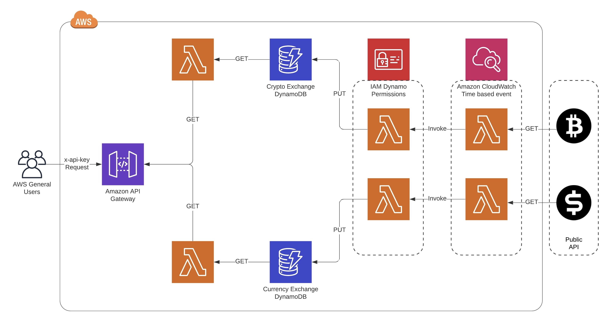

# Creating Microservices with AWS Lambda and API Gateway through Serverless Framework

The purpose of this project is to design RESTful APIs using AWS Lambdas (written in Python) and API Gateway and manage the infrastructure as code (IaC) via the Serverless Framework. The distributed microservices architecture will create lambda that will fetch data from external data sources on a regular cadence and store them in their own DynamoDB. And, the other lambdas will allow users to perform CRUD operations on the data.

Since the project's architecture is fairly simple right now, all the services and resources are centrally configuration in the `serverless.yaml`. However, when the complexity will grow the services and resources will be managed in its own YAML file.

Additional project features:

1. The `stage` param allows you to replicate the resources across different project environment, such as `pord`,`test`,`dev` etc.
2. The `serverless-offline` plugin allows you to test lambdas locally before deploying them 
3. The `apiKey` let's create private APIs which can only be accessed with a valid key.
4. The changes to the IaC can tagged in `package.json` through `npn-version [patch|minor|major]` and version controlled by Git.

## API Docs
A detailed API documentation is maintained at [API-DOCS.md] (API-DOCS.md).

## Prerequisites
Create a `~/.bash_profile` to add environment variables.
~~~
AWS_ACCESS_KEY_ID="access-key"
AWS_SECRET_ACCESS_KEY="secret-key"
AWS_DEFAULT_REGION="aws-region"
LAMBDA_API_KEY="api-key*"
~~~
*The `api-key` should be at least 20 char long

Go to the `/serverless` directory and source the bash profile

~~~
source ~/.bash_profile
~~~

To install Python3 libraries, run
~~~
pip3 install -r requirements.txt
~~~

## Serverless Commands
To run to Serverless Framework at localhost for development/ testing, run 
~~~
sls offline --stage stageName --apiKey your-api-key
~~~
* Both `stage` & `apiKey` is required
* All the endpoints in the project will require `API Key` for authorization. You can pass `your-api-key` in `x-api-key` 
header params. 
* If you want to change the authorization type to `No Auth`, remove `cors` and `private` attributes from `serverless.yaml -> function -> event`

To provision/ update AWS resources, run
~~~
sls deploy --stage stageName
~~~
To Destroy/ Remove all the infrastructure managed via the Serverless. 
~~~
sls remove --stage stageName
~~~

## References
#### Public APIs
* CoinBase - Crypto Exchange
* CoinDesk - Currency Exchange
